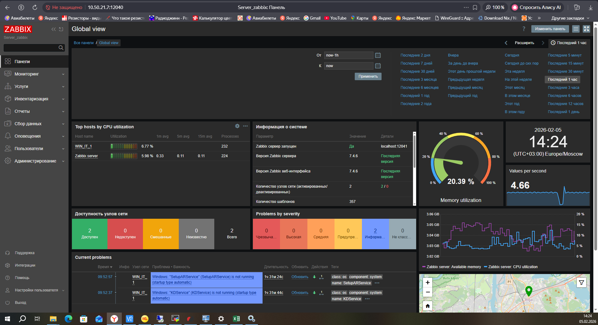
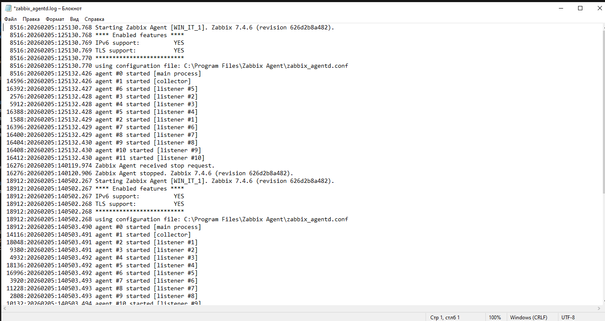
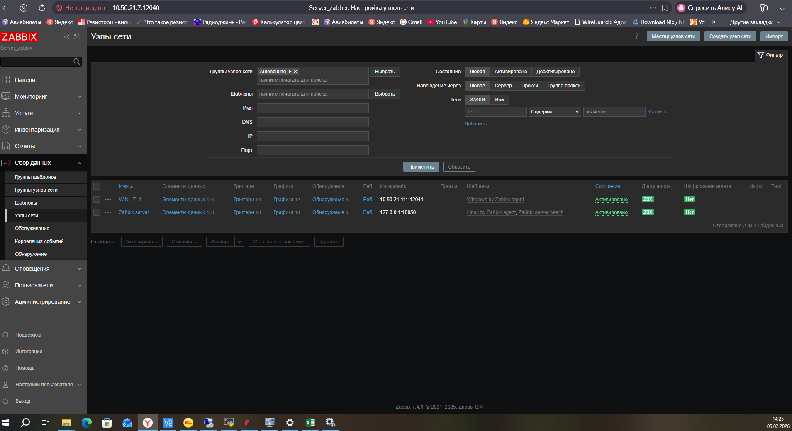
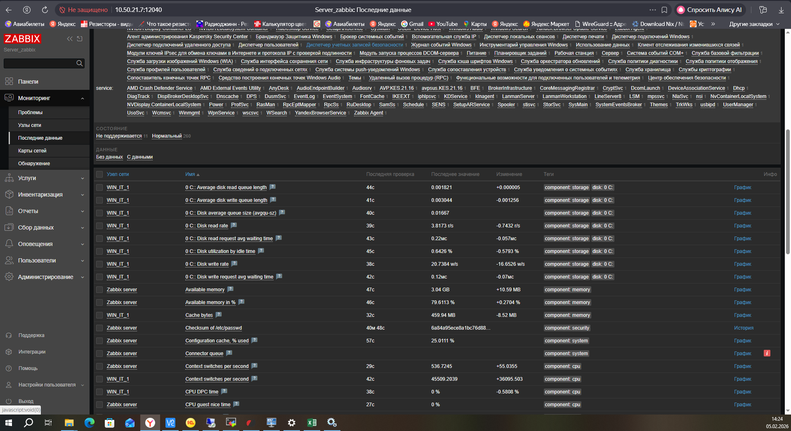
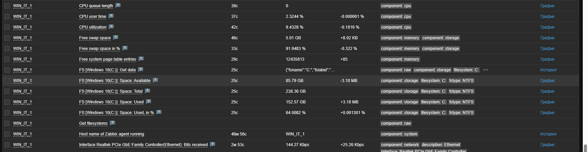

# Домашнее задание к занятию «Система мониторинга Zabbix» Гришин Д. А

В практике есть 2 основных и 1 дополнительное (со звездочкой) задания. Первые два нужно выполнять обязательно, третье - по желанию и его решение никак не повлияет на получение вами зачета по этому домашнему заданию, при этом вы сможете глубже и/или шире разобраться в материале. 

Пожалуйста, присылайте на проверку всю задачу сразу. Любые вопросы по решению задач задавайте в разделе "Вопросы по заданию".

### Цели задания
1. Научиться устанавливать Zabbix Server c веб-интерфейсом
2. Научиться устанавливать Zabbix Agent на хосты
3. Научиться устанавливать Zabbix Agent на компьютер и подключать его к серверу Zabbix 

### Задание 1 

Установите Zabbix Server с веб-интерфейсом.

#### Процесс выполнения
1. Выполняя ДЗ, сверяйтесь с процессом отражённым в записи лекции.
2. Установите PostgreSQL. Для установки достаточна та версия, что есть в системном репозитороии Debian 11.
3. Пользуясь конфигуратором команд с официального сайта, составьте набор команд для установки последней версии Zabbix с поддержкой PostgreSQL и Apache.
4. Выполните все необходимые команды для установки Zabbix Server и Zabbix Web Server.

#### Требования к результатам 
1. Прикрепите в файл README.md скриншот авторизации в админке.
2. Приложите в файл README.md текст использованных команд в GitHub.

---

### Задание 2 

Установите Zabbix Agent на два хоста.

#### Процесс выполнения
1. Выполняя ДЗ, сверяйтесь с процессом отражённым в записи лекции.
2. Установите Zabbix Agent на 2 вирт.машины, одной из них может быть ваш Zabbix Server.
3. Добавьте Zabbix Server в список разрешенных серверов ваших Zabbix Agentов.
4. Добавьте Zabbix Agentов в раздел Configuration > Hosts вашего Zabbix Servera.
5. Проверьте, что в разделе Latest Data начали появляться данные с добавленных агентов.

#### Требования к результатам
1. Приложите в файл README.md скриншот раздела Configuration > Hosts, где видно, что агенты подключены к серверу
2. Приложите в файл README.md скриншот лога zabbix agent, где видно, что он работает с сервером
3. Приложите в файл README.md скриншот раздела Monitoring > Latest data для обоих хостов, где видны поступающие от агентов данные.
4. Приложите в файл README.md текст использованных команд в GitHub

---
## Задание 3 со звёздочкой*
Установите Zabbix Agent на Windows (компьютер) и подключите его к серверу Zabbix.

#### Требования к результатам
1. Приложите в файл README.md скриншот раздела Latest Data, где видно свободное место на диске C:

## Критерии оценки

1. Выполнено минимум 2 обязательных задания
2. Прикреплены требуемые скриншоты и тексты 
3. Задание оформлено в шаблоне с решением и опубликовано на GitHub

---

### Задание 1

# Установка Zabbix server, Frontend, Agent, postgresql
1. sudo -s
2.  apt update && sudo apt upgrade
3.  apt install postgresql
4.  wget https://repo.zabbix.com/zabbix/7.4/release/ubuntu/pool/main/z/zabbix-release/zabbix-release_latest_7.4+ubuntu24.04_all.deb
5.  dpkg -i zabbix-release_latest_7.4+ubuntu24.04_all.deb
6.  apt update
7.  apt install zabbix-server-pgsql zabbix-frontend-php php8.3-pgsql zabbix-apache-conf zabbix-sql-scripts zabbix-agent
8.  sudo -u postgres createuser --pwprompt zabbix
9.  sudo -u postgres createdb -O zabbix zabbix
10. zcat /usr/share/zabbix/sql-scripts/postgresql/server.sql.gz | sudo -u zabbix psql zabbix
11. DBPassword=SECRET
12. systemctl restart zabbix-server zabbix-agent apache2
13. systemctl enable zabbix-server zabbix-agent apache2

`

---

### Задание 2

# лог zabbix agent(Windows)

# Configuration > Hosts

# Monitoring > Latest data

 

## В windows:
Поставил через установщик .exe и настроил конфиг агента hostname=WIN_IT_1, server=10.50.21.7 ListenPort=12041 и перезапустил службу агента
## В ubuntu: 
1. sudo -s
2. wget https://repo.zabbix.com/zabbix/7.4/release/ubuntu/pool/main/z/zabbix-release/zabbix-release_latest_7.4+ubuntu24.04_all.deb
3. dpkg -i zabbix-release_latest_7.4+ubuntu24.04_all.deb
4. apt update
6. apt install zabbix-agent
5. nano /etc/zabbix/zabbix_agentd.conf
8. systemctl restart zabbix-agent
9. systemctl enable zabbix-agent
---

### Задание 3

